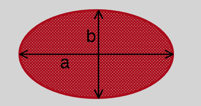

#### GalactiClass Galaxy Morphology Detector

## Background:
Edwin Hubble devised a scheme for classifying galaxies in his 1936 book The Realm of the Nebulae called The Hubble sequence also known as the Hubble tuning-fork. 
Hubble's scheme divides galaxies into three broad classes based on their visual appearance:

1. Spiral Galaxies
Spiral galaxies are named for their bright spiral arms, which are prominent due either to bright O and B stars (evidence for recent star formation), or to dust lanes

note:
- Loads of research available for spiral galaxies, probably the easiest to classify.

2. Elliptical Galaxies
Elliptical galaxies are smooth, usually round, and almost featureless. No spiral arms or dust lanes. Generally lacking in cool gas and hence few young blue stars.

(important) 
Ellipticity is defined as: 
    E = 1 - b/a 

--
(not too important for our project but good to know)
Sub-Class Eliptical Galaxies can be found with: (where n denotes subclass)
b/a = 1 - n/10 
-- 

3. Irregular Galaxies
Galaxies that don't fit into the Hubble Sequence are called Irregular galaxies. These types of galaxies are typically defined as small blue galaxies
lacking any organized spiral structure.

Also some irregular galaxies are also called starburst or interacting galaxies, These have a disturbed appearance due to recent episodes of violent star formation,
or close encounters with other galaxies

note:
- Probably the hardest to classify, might implement some confidence threshold and set irregular as last resort. 

## Version Control
Maintain a Master Branch and Develop branch, Collaborators will branch off the Develop branch and periodic merges will be made to Master.

## Notes on All Data (Input / Test)
All data is real time data from the Sloan Digital Sky Survey. I attempted to pull telescope facing galaxies for best project results.

## Galaxy Data Metadata

## Galaxy Data Retrieval

